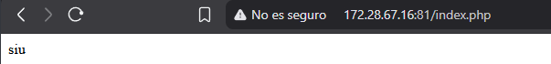
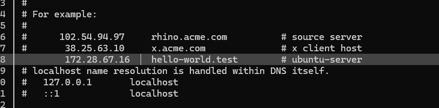
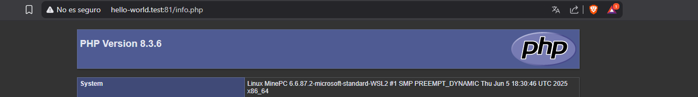
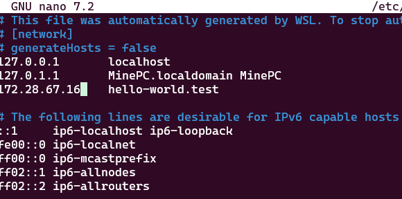
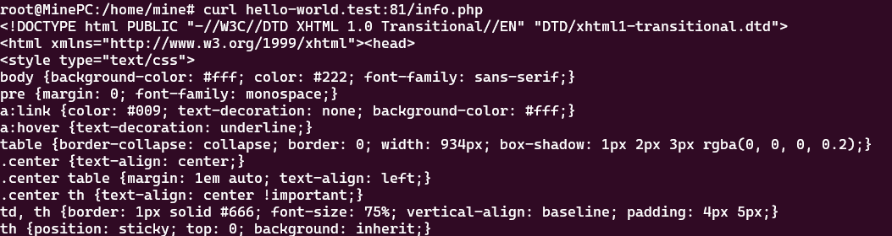

# INSTALACIÓN DE SERVICIO NGINX

## INSTALACIÓN

- Instalaremos el servicio

```sh
apt-get install nginx -y
```

- Una vez instalado nos dirigiremos al directorio /etc/nginx/sites-avalible

```sh
cd /etc/nginx/sites-avalible/
```

- Creamos un archivo donde realizaremos la configuración

```sh
nano desplegado
```

- Ponemos esta configuración que esta explicado dentro del codigo y guardamos el documento
- Yo usare el puerto 81 para distinguirlo

```sh
server{
        listen 81; #puerto de escucha
        server_name localhost; #nombre del servidor
        root /var/www/html; #ubicacion del archivo que se usara para desplegar
        index index.html; #el noombre del archivo con su extension
        location / {
                try_files $uri $uri/ =404;
        }
}
```

- Realizaremos un enlace para copiar la configuración en la carpeta enable

```sh
ln -s /etc/nginx/sites-available/desplegado /etc/nginx/sites-enabled/
```

- Nos derigiremos a crear el documento que será desplegado en /var/www/html

```sh
cd /var/www/html
```

- Creamos el documento de prueba

```sh
nano index.html
```

- El contenido que quieras que muestre la pagina web.
- En este caso sera html pero **puede ser php**.

```sh
#index.html
#ejemplo html

<h1>HOLA MUNDOO</h1>
```

```sh
#index.php
#ejemplo php

<?php

$saludo = "siu";

?>

<?= $saludo ?>
```

- Reiniciamos el sistema para poder cargar toda la configuración que hemos realizado

```sh
systemctl restart nginx
```

- Verificaremos cual es la ip que con corresponde con el siguiente comando

```sh
ip a
```

- Buscamos en el navegador poniendo el nombre del archivo y teniendo en cuenta el puerto de escucha

```sh
http://172.28.67.16:81/index.html
```

### EN EL CASO DE USAR PHP COMO DOCUMENTO

- Instalamos php para que el sistema pueda interpretar las paginas php

```sh
sudo apt install php-fpm -y
```

- Veamos la version del php instalada, apareciendo el nombre de los ficheros con la version de php

```sh
ls /run/php/
```

- Incluimos estas lineas en el archivo configurado mediante nano en /etc/nginx/sites-avalible/desplegado

```sh
    include snippets/fastcgi-php.conf;
    fastcgi_pass unix:/run/php/php8.3-fpm.sock;
```

- Comentamos la linea de try_files con #, Quedando así

```sh
server{
        listen 81;
        server_name localhost;
        root /var/www/html;
        index index.php;
        location / {
#               try_files $uri $uri/ =404;
                include snippets/fastcgi-php.conf;
                fastcgi_pass unix:/run/php/php8.3-fpm.sock; #hacemos coincidir la version con la que hemos instalado
        }
}
```

- Reiniciamos el servicio para un correcto funcionamiento

```sh
sudo systemctl restart nginx
```

- Verificaremos cual es la ip que con corresponde con el siguiente comando

```sh
ip a
```

- Buscamos en el navegador poniendo el nombre del archivo y teniendo en cuenta el puerto de escucha

```sh
http://172.28.67.16:81/index.php
```



- Para ver la informacion de php realizaremos el siguiente comando que nos permite escribier el texto previo en el documento que deseemos en este caso info.php

```sh
echo "<?php phpinfo(); ?>" | sudo tee /var/www/html/info.php
```

- Veamos la información que tiene el php instalado en el servidor

```sh
http://172.28.67.16:81/info.php
```


## USO DE VIRTUAL HOST

### Windows

- Nos dirigimos mediante consola al directorio correspondiente de hosts

```sh
cd C:\Windows\System32\drivers\etc
```

- Editaremos el documentos hosts mediante edit

```sh
edit hosts
```

- Incluiremos esta liena de codigo correspondiente con la ip de la maquina ubuntu server y el alias que pondremos a la ip

```sh
172.28.67.16    hello-world.test        # ubuntu-server
```



- Comprobamos el acceso al servidor mediante el alias



### Ubuntu/Linux

- Nos dirigimos a configurar el archivo hosts ubicado en /etc/hosts

```sh
nano /etc/hosts
```

- Agregaremos las siguientes lineas de codigo, teniendo en cuenta la ip del servidor donde realizaremos el alias de la ip

```sh
172.28.67.16    hello-world.test
```



- En mi caso estoy usando WSL para la pruebas, entonces usare el Curl para que me devuelva la información.



## BORRADO CORRECTO

- Comprobamos los archivos insalados asociados al nombre nginx

```sh
dpkg -l | grep nginx
```

- Eliminaremos los archivos que se mostraron en la información

```sh
sudo apt purge nginx nginx-common nginx-core

sudo apt autoremove
```

- eliminaremos los archivos residuales de la carpeta principal de nginx

```sh
sudo rm -rf /etc/nginx
```

- actualizamos el sistema

```sh
sudo apt update
```
