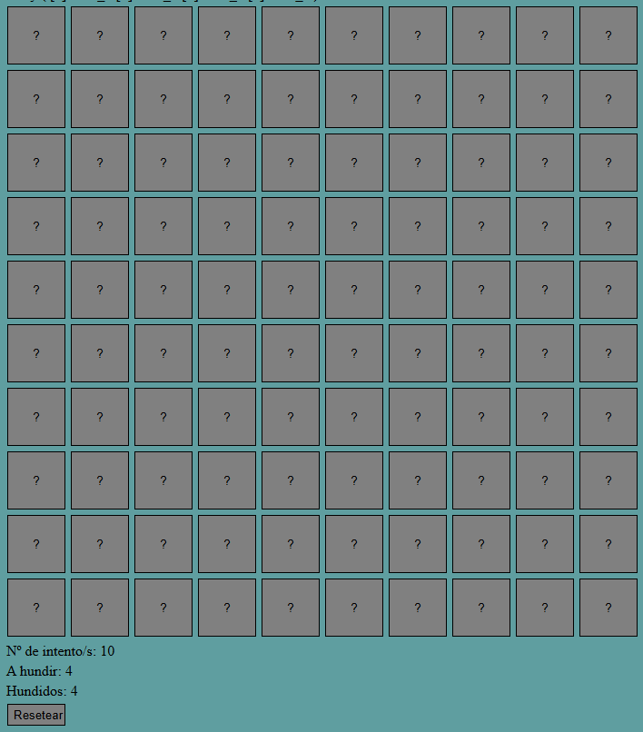
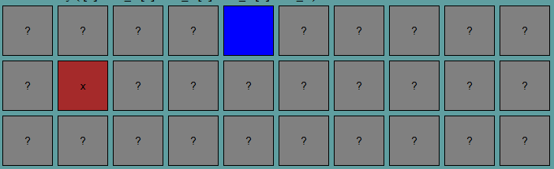
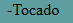

# HUNDIR LA FLOTA EN PHP

El juego de hundir la flota es un juego de mesa que trata de mediante tactica o suerte, intentar hundir todos los barcos del enemigo que el posiciono en el tablero. En este caso se ha simulado ese juego de forma individual y el posicionamiento de los barcos creada de forma aleatoria.

## REQUISITOS PARA DESPLEGARLO

Necesitaremos un servidor que admita php, XAMPP, NGINX y APACHE entre otros.

## COMO JUGAR

Sencillo, primero hablemos de las reglas del juego, hundir la flota tiene una serie de reglas y consecutivamente se dará el procedimiento para lanzar el juego con la distribucion asignada.

### REGLAS:

> Se desplegaran 4 barcos.

> Los barcos tienen una longitud de 4 casillas (en este caso).

> Los barcos se pueden desplegar de forma horizontal o vertical pero no diagonal.

> Tendras una serie de intentos para intentar encontrar a los barcos y destruirlos.

> Para ganar debes destruir los barcos, necesitaras dar a las 4 casillas de todos los barcos.

### COMO INICIAR:

Cuando entremos a la web del juego en este caso, deberemos entrar a la web ``entrada.php``, para que nos pregunte la cantidad de intentos a elegir para su correcta jugabilidad.

Una vez entremos, nos aparecera una pantalla preguntando por la cantidad de intentos que deseamos jugar, *si es menor al numero de barcos asignara automaticamente 40, igual si lo dejas vacio.*

Cuando le demos a jugar nos mostrará una pantalla con el tablero preparado para poder jugar, por defecto viene un tablero 10x10. 

En el tablero se notará que tenemos uno cuadros grises que, al hacer click podremos ver que cambia dependiendo de lo que se encuentre debajo de la casilla, si fuera agua, azul, y si fuera barco, rojo

El boton de reiniciar nos rederigira al inicio (mostrando la primera imagen)

Cuando sucede algo en el teblero, ocurre lo siguiente, mostrandonos texto de lo ocurrido.

## DIAGRAMA DE FLUJO

Vamos a realizar el diagrama de flujo donde podremos tener en cuenta como funciona el programa.

Si el valor de intentos es menor o igual a 0 al numero casillas con barco, se asignaran 40 intentos de forma automática.

Una vez estemos en la tabla de juego si encontramos todas las casillas de barcos antes de que se nos acaben los intentos se ganará la partida, sino perderemos.

Si damos al boton de resetear, este nos mandará a la pagina de ``entrada.php`` reiniciando la partida

