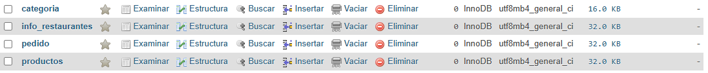

# Proyecto Restaurantes

Realizaremos un proyecto donde los restaurantes deberan **iniciar sesión** mediante **Correo** y **Contraseña**.

Estos datos seran ingresados a la base de datos mediante la interpretacion de un **administrador**, este los **registrará de forma manual** para evitar el uso de paginas externas para mayor seguridad de las contraseñas.

Los Restaurantes **realizan los pedidos** a una empresa mayorista, para la adquisición de los productos.

## Pasos a seguir

### Analisis de datos

- Realizaremos una **base de datos** donde se veran reflejados **todos los campos** que necesitaremos para su correcta implementación.

### Campos que se necesitan

|restaurante|productos|pedido|categoría|
|-----------|---------|------|---------|
|codigo     |codigo   |codigo|codigo   |
|nombre     |nombre   |fecha |nombre   |
|email      |descripción|productos(pedidos)|descripción
|codPostal  |precio|productos(cantidad)|
|contraseña |cantidad |precio(compraTotal)|
|           |codigo(Categoría)|enviados(si,no)

 

### Interpretar los datos

- como podemos ver hay cosas que debemos tener en cuenta como pueden ser en **productos**. Este tiene una **claveForanea de categoria**, lo que nos permite ver a que categoria pertenece 

- En **pedido** podemos ver que tiene **muchas clavesForaneas** con lo que queremos obtener: (productos pedidos, cantidad de productos, el precio total y si fueron enviados)

### Analisis de estructura de página

- solicitan una web donde, como restaurante, podamos iniciar sesion y podamos comprar los productos que deseemos.

> faltan 
> > parte 1 - 1,5 \
> > parte 3 - 1,5